  

  
  
  
  
  

# ⌨️ Awesome Ergonomic Keyboard & Peripheral

> **Curated Index of Commercial Ergonomic Keyboards, Open-Source Firmware & Hardware Solutions**  
> *Focused on Split Keyboards, Tenting Solutions, Columnar Stagger Layouts & RSI Prevention*

---

## 💡 Overview & SEO Guide

Welcome to the definitive guide for **Ergonomic Keyboards**, **Split Mechanical Keyboards**, and **Open-Source Keyboard Firmware**. Whether you are suffering from **Repetitive Strain Injury (RSI)**, carpal tunnel syndrome, or looking to build a fully customizable **QMK/ZMK** split keyboard, this curated repository provides comprehensive data on commercial hardware, open-source PCB designs, and configuration tools.

---

## 📖 Table of Contents

- [📊 Sector Market Overview](#-sector-market-overview)
- [🏢 Commercial Hardware & SaaS Products](#-commercial-hardware--saas-products)
- [🔓 Open-Source Firmware & Hardware Projects](#-open-source-firmware--hardware-projects)
- [🤝 How to Contribute](#-how-to-contribute)
- [⚠️ Ergonomic Disclaimer & Usage Notes](#️-ergonomic-disclaimer--usage-notes)
- [📈 Star History](#-star-history)
- [💖 Support & Community](#-support--community)

---

## 📊 Sector Market Overview

**📈 Market Size & Industry Structure**:  
The global ergonomic keyboard and specialized computer peripherals market is estimated at **$2.8 Billion in 2026** and projected to expand to **$4.9 Billion by 2032** (CAGR ~9.8%). The sector is **moderately fragmented**: mega-cap hardware conglomerates (**Microsoft**, **Logitech**) capture high-volume enterprise and unibody office deployments, whereas hyper-specialized boutique engineering firms (**ZSA Technology Labs**, **Kinesis**, **Dygma Lab**) dominate the high-margin split-mechanical, ortholinear, and enthusiast customization tiers.

---

## 🏢 Commercial Hardware & SaaS Products

> *Products sorted by Company Size / Valuation in descending order.*

| Company Size / Valuation | Product Name & Link | Pricing (Starting Tier) | Free Tier / Trial Limits | Key Features & Architecture |
| :--- | :--- | :--- | :--- | :--- |
| **~$3.1T Valuation** *(~$281B Rev)* | **[Microsoft Ergonomic Keyboard](https://www.microsoft.com/en-us/accessories/microsoft-ergonomic-keyboard)** | **$59.99** one-time purchase | **30-day return trial**; Mouse & Keyboard Center app free forever | Mainstream unibody split keyframe, cushioned palm rest, dedicated media & Office hotkeys. |
| **~$13.5B Valuation** *(~$4.3B Rev)* | **[Logitech Ergo K860](https://www.logitech.com/en-us/products/keyboards/k860-split-ergonomic.920-009166.html)** | **$129.99** one-time purchase | **30-day money-back guarantee**; Logi Options+ software free forever | Wireless split keyboard, 3-layer pillowed wrist rest, negative tilt adjustment, Bluetooth & Logi Bolt. |
| **~$50M Valuation** *(~$15M Rev)* | **[Kinesis Freestyle2](https://kinesis-ergo.com/shop/freestyle2-for-pc-us/)** | **$99.00** one-time purchase | **60-day money-back trial period**; SmartSet programming engine free | Modular split chassis (up to 9" separation), optional VIP3 & V3 tenting accessories, low-force keys. |
| **~$35M Valuation** *(~$10M Rev)* | **[ZSA Moonlander / ErgoDox EZ](https://www.zsa.io/moonlander/)** | **$354.00** base model | **30-day full refund trial**; Oryx Web Configurator free forever (unlimited keymaps) | Columnar stagger layout, thumb cluster, hot-swappable switches, open-source QMK support, 10/10 iFixit score. |
| **~$15M Valuation** *(~$5M Rev)* | **[Dygma Raise / Defy](https://dygma.com/)** | **$369.00** base model | **30-day trial with full refund**; Bazecor configuration app open source & free forever | Split ergonomic mechanical keyboard, integrated palm rests, underglow RGB, wireless Bluetooth & RF options. |
| **~$12M Valuation** *(~$4M Rev)* | **[Matias Ergo Pro](https://matias.store/products/ergo-pro-keyboard)** | **$215.00** one-time purchase | **30-day money-back return policy**; hardware macro remapping driverless free forever | Split chassis with quiet click mechanical switches, leg tenting support, integrated gel palm pads. |
| **~$8M Valuation** *(~$2.5M Rev)* | **[Cloud Nine C989 Ergo](https://cloudnineergo.com/)** | **$199.99** one-time purchase | **30-day trial period**; companion RGB control app free download | Full-size mechanical split keyboard, Cherry MX switches, central rotary dial, magnetic tenting feet. |
| **~$6M Valuation** *(~$2M Rev)* | **[Perixx PERIBOARD-512](https://perixx.com/)** | **$49.99** one-time purchase | **30-day money-back guarantee**; standard plug-and-play OS drivers | Budget 3D curved split unibody design, tactile key response, integrated wrist support. |
| **~$5M Valuation** *(~$1.5M Rev)* | **[Goldtouch V2 Adjustable](https://www.goldtouch.com/)** | **$79.00** one-time purchase | **30-day return policy**; driverless plug-and-play hardware engine | 0°-30° continuous vertical tenting and horizontal split adjustment, compact portable footprint. |

---

## 🔓 Open-Source Firmware & Hardware Projects

> *Repositories sorted by GitHub Star Count in descending order. Click star badges to visit stargazers.*

| Star Count Badge | Open-Source Project & Link | Description & Architectural Highlights |
| :---: | :--- | :--- |
|  | **[QMK Firmware](https://github.com/qmk/qmk_firmware)** | **The industry-standard open-source keyboard firmware.** Powers thousands of custom mechanical and ergonomic split keyboards with deep C matrix scanning, tap-dance, layers, and leader keys. |
|  | **[Corne Keyboard (crkbd)](https://github.com/foostan/crkbd)** | **Extremely popular split 3x6 columnar stagger keyboard.** Features OLED screen support, per-key RGB backlighting, low-profile Choc switch support, and compact portable form factor. |
|  | **[ZMK Firmware](https://github.com/zmkfirmware/zmk)** | **Next-generation wireless firmware built on Zephyr RTOS.** Engineered specifically for modern Bluetooth split keyboards (nice!nano MCUs) with exceptional battery efficiency and GitHub Actions compilation. |
|  | **[Redox Keyboard](https://github.com/mattdibi/redox-keyboard)** | **Ergonomic 7x5 columnar stagger split keyboard.** Open-source PCB, 3D-printable case, rotated 1.25u thumb keys, powered by Arduino Pro Micro / nice!nano with QMK, ZMK, and KMK support. |
|  | **[KMK Firmware](https://github.com/KMKfw/kmk_firmware)** | **Python-powered keyboard firmware for CircuitPython.** Enables rapid live modification of keymaps and macros without needing C compilation or flashing pipelines. |
|  | **[Charybdis Keyboard](https://github.com/bastardkb/charybdis)** | **3D curved ergonomic split keyboard with integrated trackball.** Features aggressive 3D keywell matrix, optical trackball sensor support, and QMK pointer firmware integration. |
|  | **[Vial QMK](https://github.com/vial-kb/vial-qmk)** | **Open-source real-time GUI configurator fork of QMK.** Allows instantaneous, on-the-fly layout updates, macro editing, and combo definitions without browser security restrictions. |
|  | **[Ferris Keyboard](https://github.com/pierrechevalier83/ferris)** | **Ultra-minimalist 34-key split columnar keyboard.** Designed for home-row mods and minimal finger travel, utilizing Choc low-profile switches and ultra-thin PCBs. |
|  | **[Pando Keyboard](https://github.com/JulianYap/pando)** | **Budget open-source split keyboard with integrated STM32 MCU.** Features no-solder PCB design, USB-C connectivity with ESD protection, Vial support, and accessible 3D-printed kits. |

---

## 🤝 How to Contribute

Contributions are warmly welcome! To maintain high resource quality:

1. Fork the repository.
2. Ensure entries include complete factual details (pricing, free tier terms, hardware dimensions, MCU architecture).
3. Follow the formatted markdown tables and verify external links.
4. Submit a Pull Request with a short summary of changes.

Check out the [Awesome List Guidelines](https://github.com/ishandutta2007/Awesome-Awesome-Awesome) for more details.

---

## ⚠️ Ergonomic Disclaimer & Usage Notes

* **Consult Healthcare Professionals**: Ergonomic keyboards are preventive tools designed to promote natural hand postures. If you experience persistent wrist pain, numbness, or symptoms of Carpal Tunnel Syndrome / RSI, consult a licensed medical specialist or occupational therapist.
* **Unibody vs. Split Keyboards**: Unibody ergonomic keyboards (Microsoft, Perixx) reduce forearm pronation but cannot adjust for shoulder width. Split keyboards (ErgoDox EZ, Kinesis, Dygma) allow total separation and customizable tenting angles, providing superior posture alignment.
* **Firmware Safety**: When flashing custom firmware (QMK, ZMK, KMK) on open-source hardware, always verify bootloader settings and pinouts to prevent MCU soft-bricking.

---

## 📈 Star History

---

## 💖 Support & Community

Thank you for exploring **Awesome Ergonomic Keyboard & Peripheral**! If this repository helps you find your ideal ergonomic hardware, reduce wrist strain, or configure open-source split keyboards, please consider supporting the project:

- 🌟 **Star this repository** to help others discover ergonomic workspace tools.
- 🔀 **Fork and share** with mechanical keyboard builders and accessibility advocates.
- ☕ **Sponsor the Maintainer**: Support ongoing updates via the [GitHub Sponsor Dashboard](https://github.com/sponsors/ishandutta2007).
